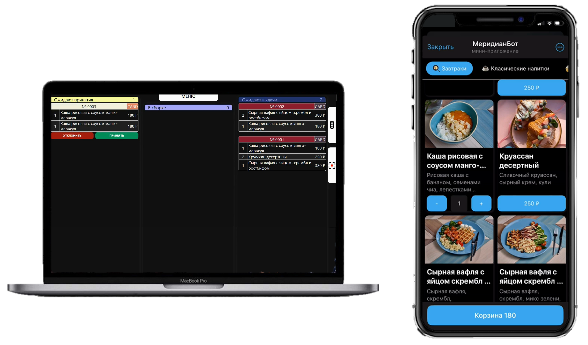
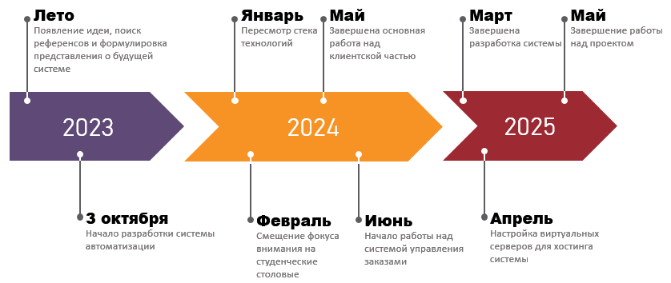
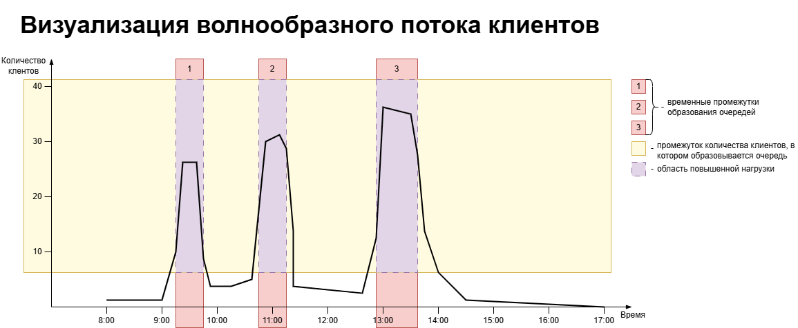
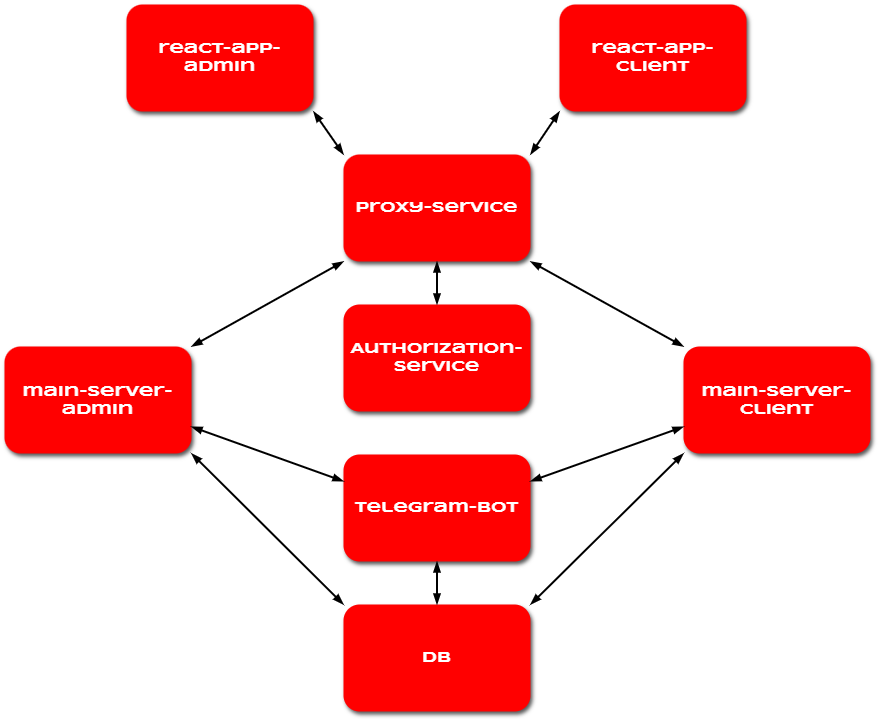

# АИС для студенческой столовой

---

Автоматизированная информационная система для студенческой столовой — система автоматизации процесса создания и обработки заказов в студенческой столовой.

#### Общие сведения

---

***Сроки разработки:*** с 3.10.23 по 10.05.25;

***Участники:*** 5 человек на старте, 1 человек в конце;

***Кураторы:*** сотрудники института;

***Партнеры:*** кондитерская «Дисертрум», студенческая столовая «Меридиан»

***Преимущетсво среди конкурентов/драйвер продвижения:*** отсутствие комиссии за заказы;

***Источники доходов:*** подписка за доступ к системе и плата за разработку и внедрение модификаций;

Проект задумывался как полный аналог группы сервисов Яндекса. Однако, после выхода из проекта 4-х участников проект выбрал нишу студенческих столовых в силу особенностей рынка предложений.

Студенческие столовые обладают волнообразным потоком клиентов в силу 2-х факторов: социальное поведение клиентов и территориальное размещение столовой.

Последний фактор волнообразного потока клиентов, территориальное размещение столовой, является камнем предкновения в отношениях с любой студенческой столовой, которое не является частью университета. Территориальное размещение делает столовую фактически монополистом, что делает ее руководство аморфным, не заинтересованным в развитии своего бизнеса.

#### Микросервисная архитектура

---

* Интерфейс для клиентов;
* Интерфейс для сотрудников столовой;
* Прокси;
* Сервер для авторизации;
* Два сервера, реализующие бизнес-логику;
* Телеграм-бот;
* БД;

#### Стек технологий

---

| Сервисы                                                       | Технологии                                                                     |
| -------------------------------------------------------------------- | ---------------------------------------------------------------------------------------- |
| Интерфейс для клиентов                           | react react-router-dom axios swiper                                       |
| Интерфейс для сотрудников                     | react react-router-dom react-qrcode-logo                                       |
| Прокси                                                         | node.js express httpProxyMiddlewars morgan                                |
| Сервер авторизации                                  | python aiohttp aiohttp_cors mysqlconnectorpython pyjwt pyrogram |
| Сервер бизнес-логики для клинтов         | node.js express morgan jsonWebToken mysql2                           |
| Сервер бизнес-логики для сотрудников | node.js express morgan jsonWebToken mysql2                           |
| Телеграм-бот                                              | python aiogram mySqlConnectorPython barcode                               |
| БД                                                                 | MySQL                                                                                    |

#### Предложения по развитию

---

1. Интеграция в систему учета, 1С;
2. Внедрение системы оплаты заказов онлайн;
3. Использование AI для генерации изображений и описаний блюд;
